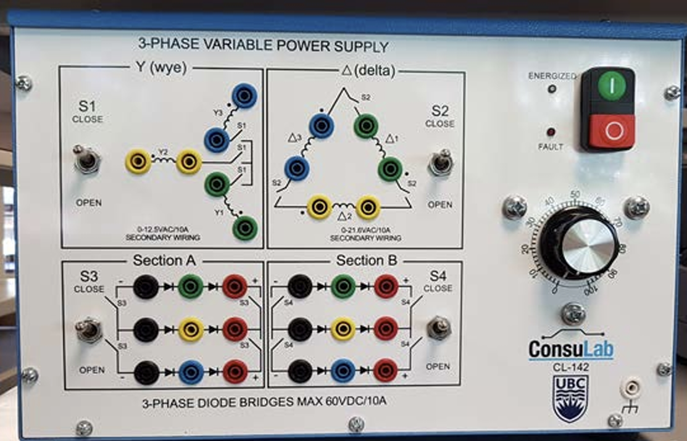
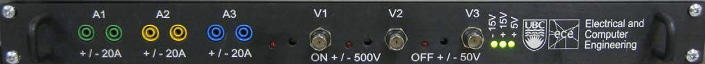
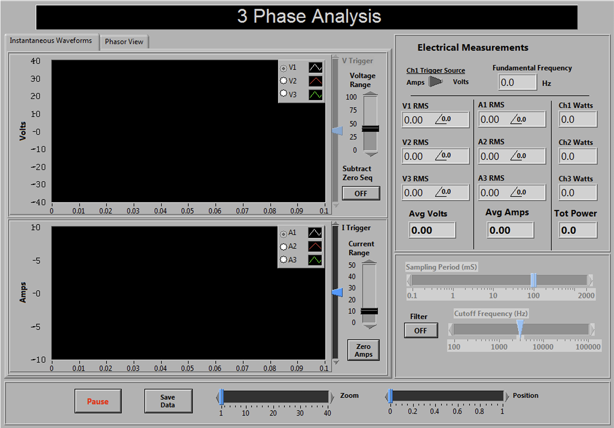
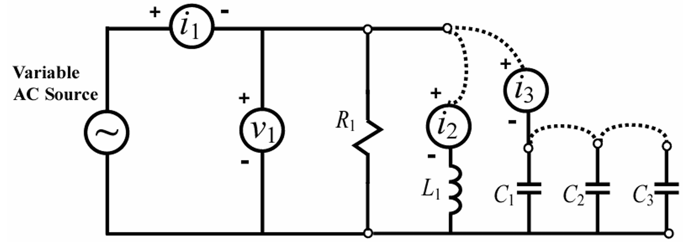
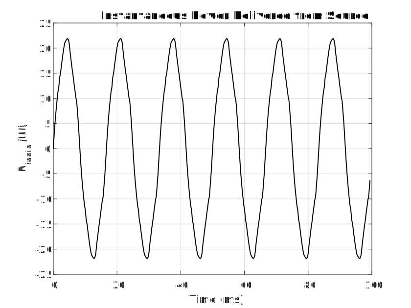
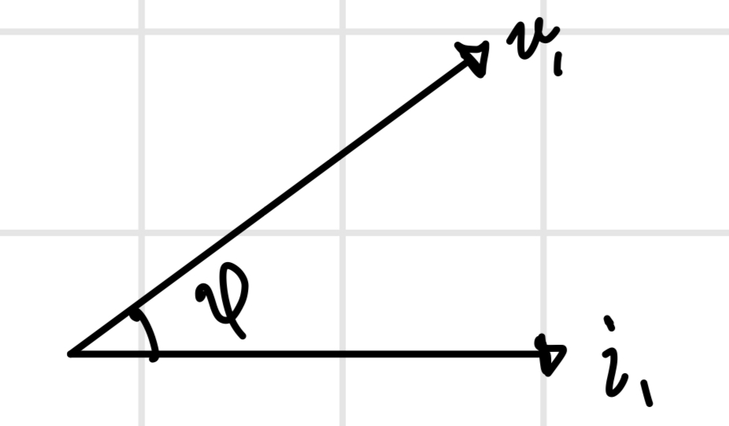
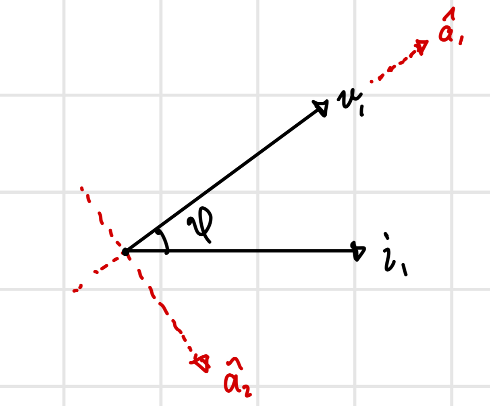

# Overview
For my electro-mechanical energy and conversion class, we had labs which mainly revolved around exploring the characteristics of transformers, motors, and power systems. Alongside these tasks was recording and plotting the power plots associated. One of the questions listed on a lab report was rather vague and asked us to plot the instantaneous, real, and reactive power of a system. But how should someone go on about plotting the real and reactive power? It is customary to think of reactive and real power being quantified as a constant value (think of the power triangle). It is for this reason that I decided to explore this question and utilize some mathematical tools in finding an answer.

# Setup
A 60Hz 3-phase power supply was provided at each station in our labs.

Each bench was equipped with a measurement box with a sampling rate of up to 2.5 MS/sec. 

The measurement box was connected to a Data Acquisition (DAQ) card inside a PC which displayed the values and measurements on a monitor window

Data corresponding to the voltmeter and ammeter channels could be exported for further use and processing.\
Using banana cables to wire the connections and ammeter channels and bnc to banana coaxiable adapters to wire the voltmeter channels, we replicate the schematic below.

Note that the inductors and capacitors are non-ideal and will exhibit some loss.

# Analysis
Referring to the schematic, we will first wire up the inductor branch. After turning on the 3-phase AC power supply, we export the data associated with the measurement channels. The data can be found in Data/... in this repository. After assigning variables to the source voltage and current, one can easily find the instantaneous power by the relation $p_{insta}(t)=v(t)i(t)$.

Now to calculate and plot the real and reactive powers. During the time of measurement, the power factor angle was given as $\phi=42.2^{\circ}$. Consider the phasor representation below. 

Recall that a load will be purely resistive if the current phasor is in phase with the voltage phasor. As such, the real power of the system can be obtained by finding a component of the current phasor that is in phase with the voltage. The same reasoning is applied to acquire the reactive power which constitutes a current that is out of phase with the voltage by $90^{\circ}$. We can do this by establishing an orthonormal basis where the two basis vectors $\hat{a_1},\hat{a_2}$ are in phase with $v_1$ and orthogonal respectively.

Let us denote the in-phase and orthogonal currents as $i_{\parallel}$ and $i_{\perp}$ respectively. Using some basic linear algebra, we can decompose $i_1$ into its corresponding components. We see that the in-phase current phasor is simply $i_{\parallel}=proj_{\hat{a_1}}i_1=|i_1|\cos{(\phi)}\hat{a_1}$. It is also obvious that $i_{\perp}= i_1-i_{\parallel}$. Since we are dealing with phasors, we can account for the direction assignment of $i_{\parallel}$ simply by adding a phase shift to $i_1$ so that $i_{\parallel}=i_1\cos{(\phi)}e^{i\phi}$. Translating from phasor notation, we get that $i_{\parallel}(t)=|i_1|\cos{(\phi)}\cos{(\omega t + \theta_{i_1} + \phi)}$ which is just $i_1(t)$ scaled by $\cos{(\phi)}$ and phase shifted by $\phi$. After finding $i_{\parallel}(t)$, $i_{\perp}(t)$ can be obtained by realizing that $i_{\perp}(t)=i_1(t)-i_{\parallel}(t)$.\
The question now arises as to how to acquire $i_{\parallel}(t)$. The current $i_1(t)$ has been sampled and exported to matlab accordingly and by nature is a discretized signal. Adding a scaling factor is very straightforward- we just multiply the signal by a constant. To add a phase shift to the signal is a bit more complicated. To tackle this issue, I tried employing a useful trigonometric identity i.e.
$\cos{(\alpha+\beta)=\cos{(\alpha)}\cos{(\beta})}-\sin{(\alpha)}\cos{(\beta)}$. That way a phase shift implemented on a discrete sinusoidal signal can be constructed from its cosine and sine parts. This is shown below
$$i_1(t+\phi/\omega)=|i_1|\cos{(\omega t+\theta_{i_1}+\phi)}=|i_1|[\cos{(\omega t+\theta_{i_1})}\cos{\phi}-\sin{(\omega t+\theta_{i_1})}\cos{\phi}]$$
$$=|i_1|\cos{(\omega t+\theta_{i_1})}\cos{\phi}-|i_1|\sin{(\omega t+\theta_{i_1})}\sin{\phi}$$
From here, my first thought was that to obtain the sin part of the signal, we could just apply $\arccos{}$ to $i_1(t)$ then apply a $\tan$ operation since $\tan{(\arccos{(\theta}))}=\sin{(\theta)}$

